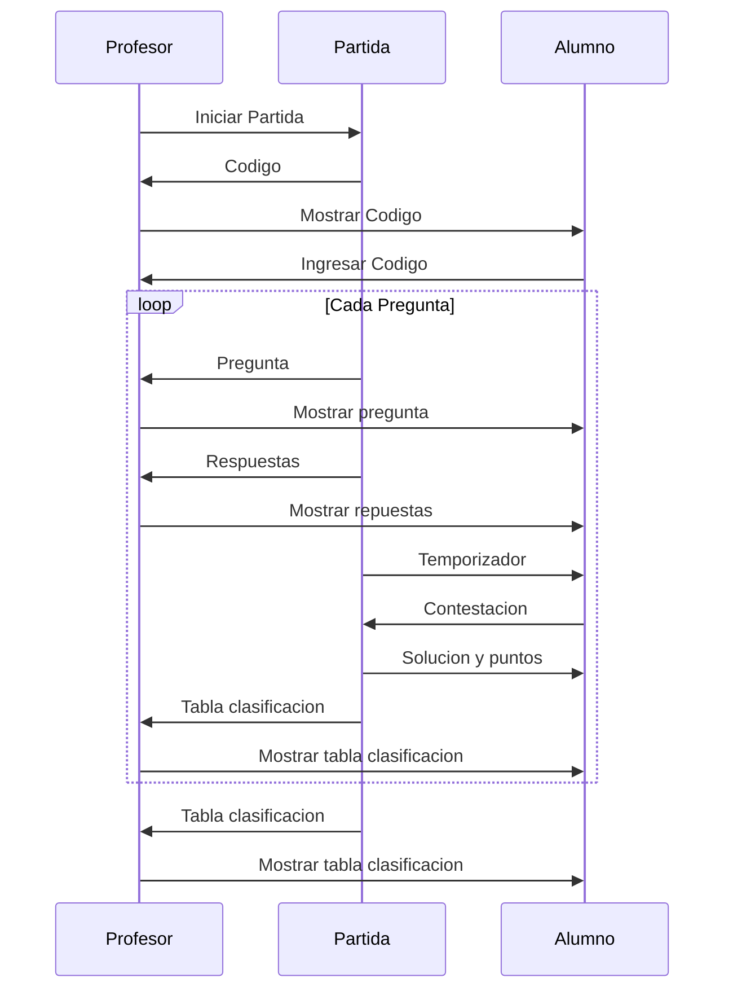
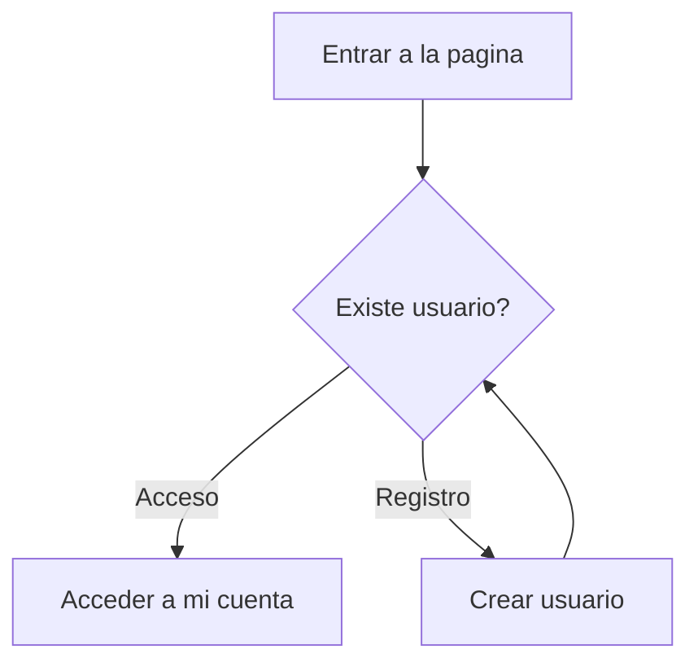
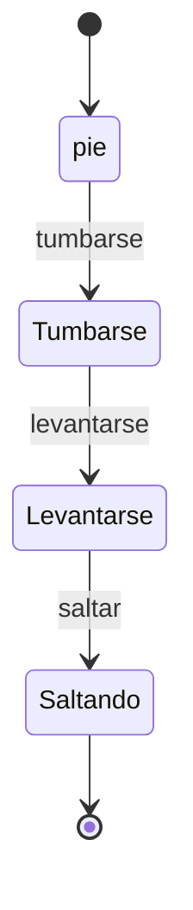

# DIAGRAMA DE CLASES
## Kahoot
Tiene tres clases la clase professor, la clase alumno y la clase partida.

# DIAGRAMA DE ACTIVIDADES
## UML de login
Como acceder en una pagina web como si ya estas logeado como si no  

# DIAGRAMA DE ESTADOS
## UML de estados
Cuales son los pasos para hacer un burpee

