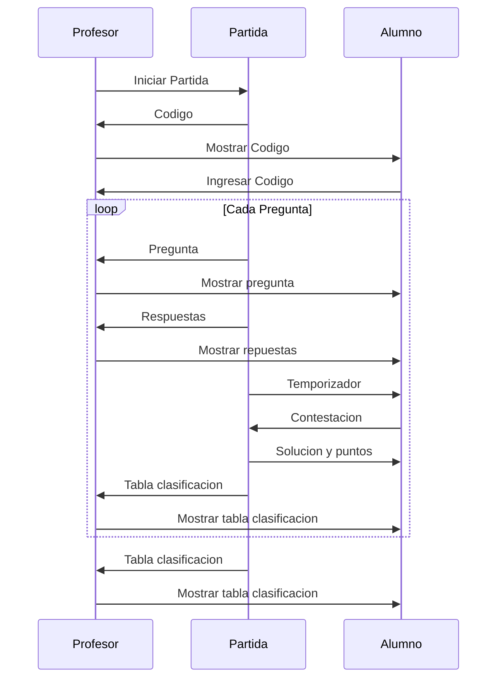
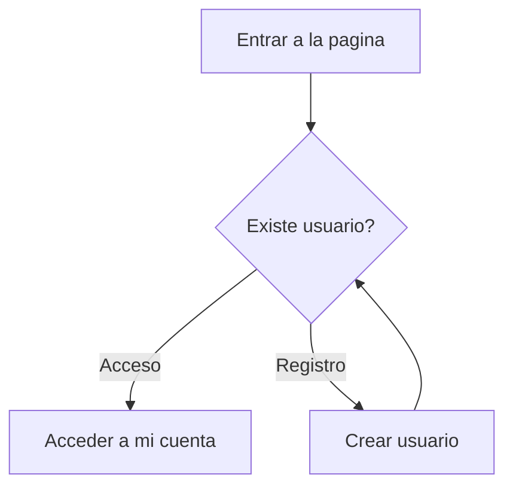
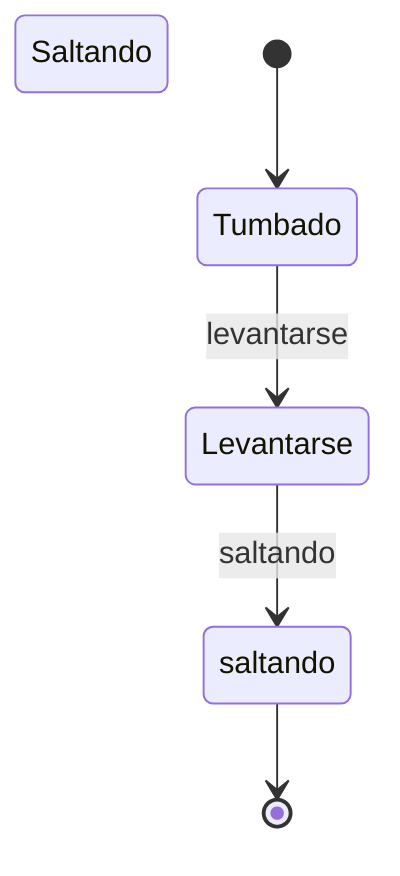

# DIAGRAMA DE CLASES
## Kahoot
Tiene tres clases la clase professor, la clase alumno y la clase partida.

```mermaid
sequenceDiagram
    Profesor->>Partida: Iniciar Partida
    Partida->>Profesor: Codigo
    Profesor->>Alumno: Mostrar Codigo
    Alumno->>Profesor: Ingresar Codigo
    loop Cada Pregunta
    Partida->>Profesor: Pregunta
    Profesor->>Alumno: Mostrar pregunta
    Partida->>Profesor: Respuestas
    Profesor->>Alumno: Mostrar repuestas
    Partida->>Alumno: Temporizador
    Alumno->>Partida: Contestacion
    Partida->>Alumno: Solucion y puntos
    Partida->>Profesor: Tabla clasificacion
    Profesor->>Alumno: Mostrar tabla clasificacion
    end
    Partida->>Profesor: Tabla clasificacion
    Profesor->>Alumno: Mostrar tabla clasificacion

```

# DIAGRAMA DE ACTIVIDADES
## UML de login

```mermaid
flowchart
    A[Entrar a la pagina] --> B{Existe usuario?}
    B --> |Acceso| C[Acceder a mi cuenta] 
    B --> |Registro| D[Crear usuario] 
    D --> B
```

# DIAGRAMA DE ESTADOS
## UML de estados

```mermaid
stateDiagram-v2
    state "Tumbado" as tumbado
    state "Levantarse" as levantado
    state "Saltando" as saltar
    [*] --> tumbado
    tumbado --> levantado: levantarse
    levantado --> saltando: saltando
    saltando --> [*]
```

